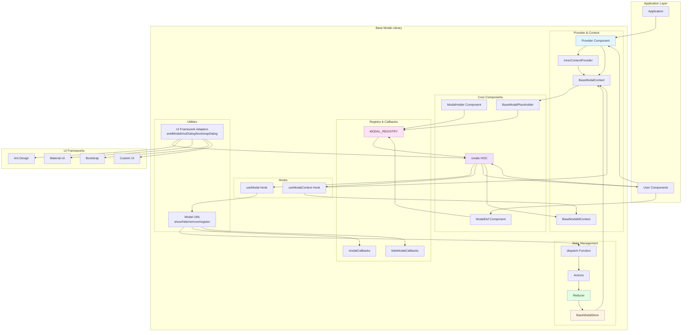
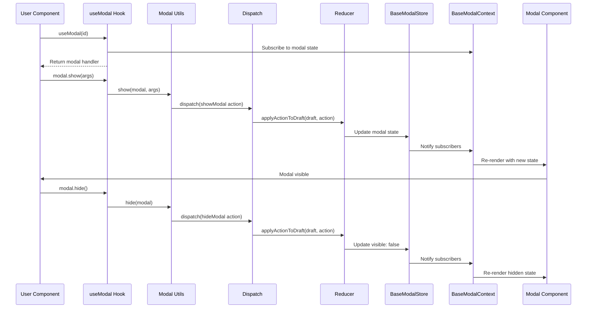
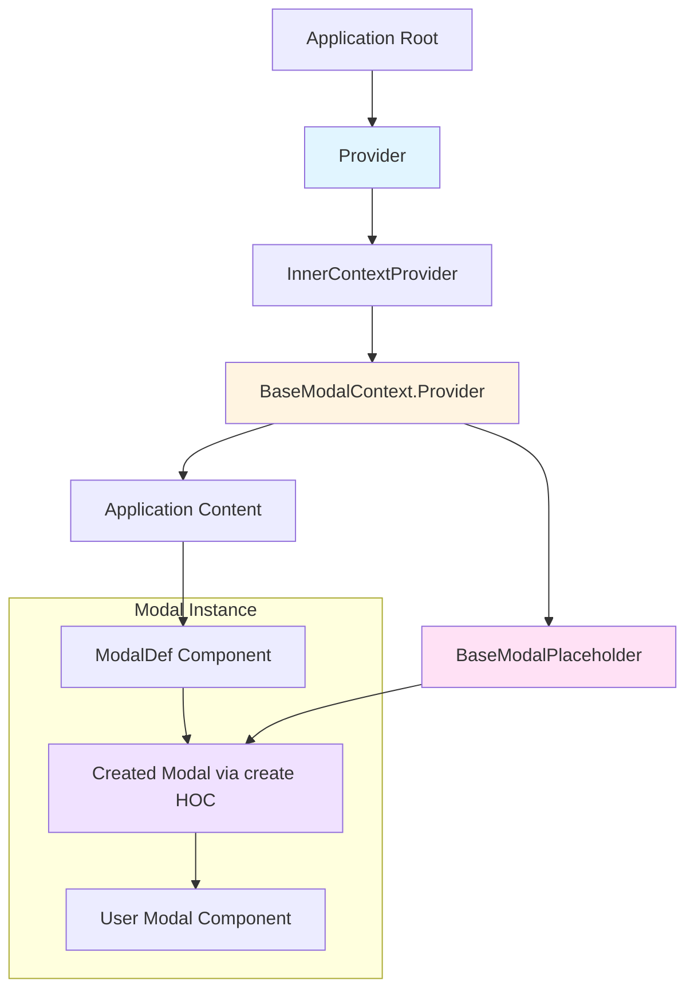
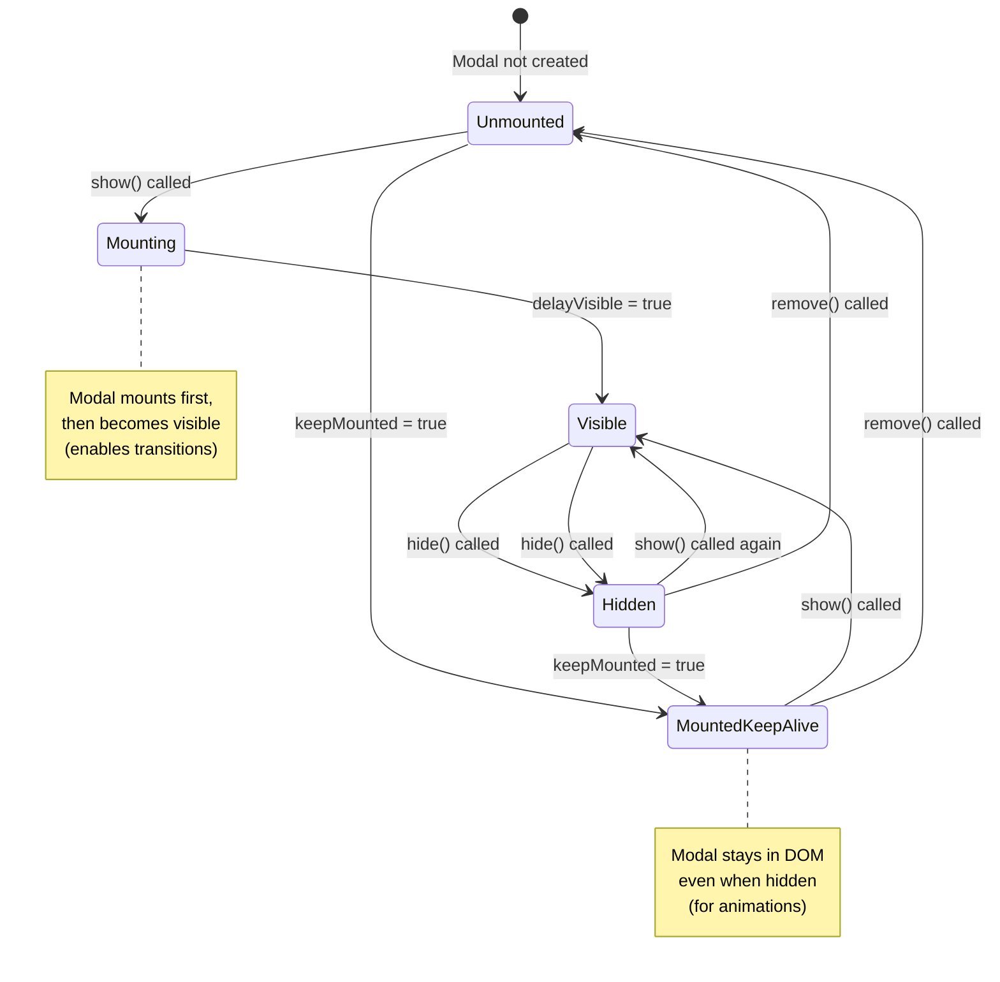
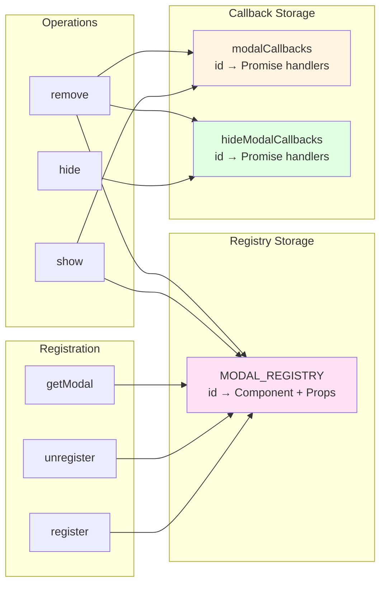
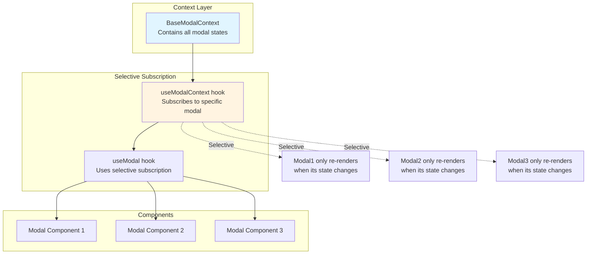
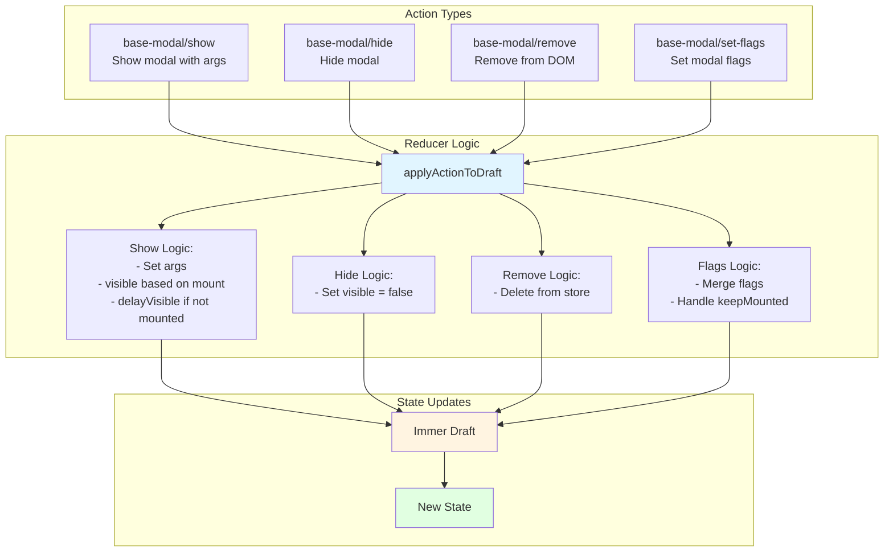
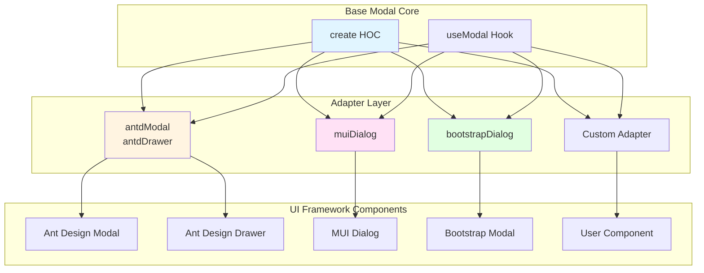

# High-Level Design

## System Architecture



## Data Flow



## Component Hierarchy



## State Management Flow



## Modal Lifecycle

```mermaid
sequenceDiagram
    participant Dev as Developer
    participant Create as create()
    participant Registry as MODAL_REGISTRY
    participant Show as show()
    participant Store as Store
    participant Component as Modal Component
    participant Resolve as Promise Resolve

    Dev->>Create: create(MyModal)
    Create-->>Dev: Enhanced Component

    Dev->>Show: show(MyModal, args)
    Show->>Registry: Check/Register modal
    Show->>Store: Dispatch show action
    Store->>Component: Mount & Show modal
    Component->>Show: Create promise

    Component->>Resolve: modal.resolve(value)
    Resolve->>Show: Promise resolves
    Show-->>Dev: Return value

    Component->>Show: modal.hide()
    Show->>Store: Dispatch hide action
    Store->>Component: Hide modal
    Component->>Show: Cleanup callbacks
```

## Registry & Callback System



## Context Subscription Pattern



## Action Types & Reducer Logic



## UI Framework Adapter Pattern



## Key Design Patterns

### 1. Higher-Order Component (HOC) Pattern
- `create()` wraps user components with modal functionality
- Provides modal state and handlers via props
- Manages mounting/unmounting lifecycle

### 2. Context Pattern
- `BaseModalContext` provides global modal state
- `BaseModalIdContext` provides current modal ID
- Selective subscriptions prevent unnecessary re-renders

### 3. Registry Pattern
- `MODAL_REGISTRY` stores registered modal components
- Enables ID-based modal lookup
- Supports declarative and imperative usage

### 4. Promise-Based API
- `show()` returns a promise that resolves when modal closes
- `modalCallbacks` and `hideModalCallbacks` manage promise resolution
- Enables async/await patterns

### 5. Reducer Pattern
- Centralized state management via reducer
- Immutable updates using Immer
- Action-based state transitions

### 6. Adapter Pattern
- UI framework adapters wrap framework-specific components
- Provides consistent API across different frameworks
- Enables framework-agnostic modal management

